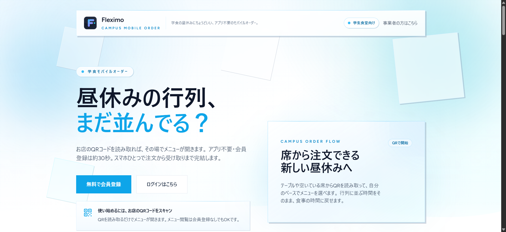
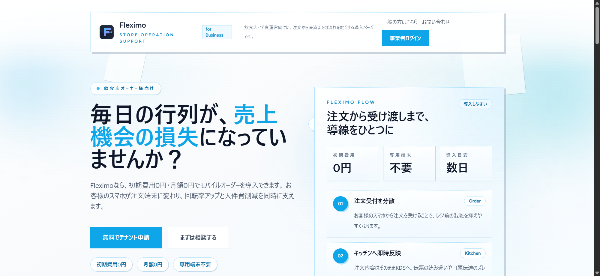

# Fleximo

[](./LICENSE)
[](#)
[](https://www.php.net/)
[](https://laravel.com/)
[](https://react.dev/)
[](https://www.typescriptlang.org/)

**Fleximo** is an open-source, multi-tenant **mobile ordering platform for Japanese restaurants and school cafeterias (学食)**.
It lets restaurant owners accept takeout orders and payments on the web with no register queue, while end-users enjoy a single account across every restaurant on the platform.



> Live reference deployment: **https://fleximo.jp**
> Status: **MVP / early-stage OSS**. APIs and schema may still change. Production use is possible but please pin to a release tag.

---

## Why Fleximo?

Most SaaS mobile-order products in Japan are closed, per-store, and expensive for small restaurants. Fleximo aims to be:

- **Self-hostable** — run it on your own server (Xserver, VPS, etc.) without per-order fees on top of the payment processor.
- **Multi-tenant by design** — one deployment serves many restaurants; customers use one account everywhere.
- **Built for the Japanese market** — fincode integration (credit card / PayPay), Japanese UI, tax-inclusive pricing, takeout-first flow.
- **Stack restaurants already trust developers with** — Laravel + React + MySQL/MariaDB + Redis.

---

## Screenshots

| Customer landing (https://fleximo.jp) | Business / tenant signup page |
| --- | --- |
|  |  |

Full-page capture: [`docs/assets/landing-full.png`](./docs/assets/landing-full.png)

---

## Features (MVP)

- Tenant (restaurant) management and tenant-admin / staff login
- Cross-tenant restaurant search for customers
- Menu browsing and per-tenant cart
- Checkout with **fincode** (credit card, PayPay), confirmed via webhook
- Kitchen Display System (KDS) for staff
- Per-tenant analytics dashboard
- **Takeout only** in the current MVP (dine-in / delivery are out of scope for now)

### Order lifecycle

```
PENDING_PAYMENT → PAID → ACCEPTED → IN_PROGRESS → READY → COMPLETED
```

Orders are never confirmed from the frontend state alone — **the fincode webhook is the source of truth**.

### Roles

| Role           | Capabilities                                                             |
| -------------- | ------------------------------------------------------------------------ |
| `tenant_admin` | Menu, staff, orders, payment settings, dashboard                         |
| `tenant_staff` | Handle orders on the KDS, update status                                  |
| `customer`     | Search restaurants, order, pay, view order history (shared across tenants) |

---

## Multi-tenant architecture

- **Single database, shared tables**, row-level isolation via `tenant_id`
- Eloquent Global Scopes + Policies + DB constraints prevent cross-tenant access
- Redis keys, queue jobs, and storage paths are all namespaced with `tenant_id`

See [`docs/reference/architecture.md`](./docs/reference/architecture.md) and [`docs/explanation/multi-tenancy.md`](./docs/explanation/multi-tenancy.md) for the full design.

---

## Tech stack

| Layer            | Tech                                           |
| ---------------- | ---------------------------------------------- |
| Backend          | Laravel 12 (PHP ^8.3)                          |
| Frontend         | React 19 + Inertia.js 2 + TypeScript 5         |
| Database         | MariaDB / MySQL                                |
| Cache / Queue    | Redis                                          |
| Auth             | Laravel Sanctum 4                              |
| Payments         | fincode (credit card, PayPay)                  |
| Styling          | Tailwind CSS 3                                 |
| Build            | Vite 7                                         |
| UI libraries     | @headlessui/react, recharts, @dnd-kit          |
| Error monitoring | Sentry                                         |

---

## Quick start (local development)

### Requirements

- PHP ^8.3 with extensions: `mbstring`, `intl`, `pdo_mysql`, `redis`
- Composer 2.x
- Node.js 20+ / npm
- MariaDB 10.6+ or MySQL 8+
- Redis 6+

### Setup

```bash
git clone https://github.com/ltac0203-pixel/fleximo-oss.git
cd fleximo-oss

composer install
cp .env.example .env
php artisan key:generate

# Configure DB / Redis / fincode credentials in .env

php artisan migrate --seed
npm install
npm run dev
```

In a separate shell:

```bash
php artisan serve
php artisan queue:listen
```

Open `http://localhost:8000`.

### Tests

```bash
composer test              # PHPUnit
npm run test               # Vitest
npm run test:e2e           # Playwright
vendor/bin/phpstan analyse # Static analysis
vendor/bin/pint            # PHP formatting
```

> Tests run against MariaDB/MySQL. SQLite is **not** supported.

---

## Configuration

Key `.env` variables (see `.env.example` for the full list):

```env
APP_URL=https://your-domain.example.com
DB_CONNECTION=mysql
REDIS_HOST=127.0.0.1

# fincode
FINCODE_API_KEY=
FINCODE_SHOP_ID=
FINCODE_WEBHOOK_SECRET=

# Legal pages (Japanese 特定商取引法 / Privacy Policy 表記用)
# OSS版を SaaS として提供する場合、必ず自社情報に書き換えてください
COMPANY_NAME="Your Company Name"
COMPANY_REPRESENTATIVE="Your Representative Name"
COMPANY_POSTAL_CODE="000-0000"
COMPANY_ADDRESS="Your Company Address"
COMPANY_CONTACT_EMAIL=contact@example.com
```

> **Important for self-hosters in Japan**: The bundled Legal pages (`/legal/transactions`, `/legal/privacy-policy`, `/legal/terms`, `/legal/tenant-terms`) display placeholder values from `config/legal.php`. You **must** override the `COMPANY_*` variables in your `.env` before going to production — these texts are referenced from a Japanese 特定商取引法 (Specified Commercial Transactions Act) standpoint, and showing placeholders to real users is not legally compliant.

---

## Project layout

```
app/              Laravel application (Controllers, Services, Models, Policies)
resources/js/     React + Inertia frontend (TypeScript)
routes/           HTTP / Inertia / API routes
database/         Migrations, factories, seeders
docs/             Diátaxis-organized documentation (tutorials / how-to / reference / explanation)
tests/            PHPUnit + Vitest + Playwright tests
```

---

## Roadmap

- Dine-in / delivery flows
- Multi-language UI (EN / JA first, then KR / ZH)
- Third-party POS integration (Square, Airレジ)
- Tenant self-signup and billing
- Inventory and ingredient tracking

Issues and pull requests are tracked on GitHub.

---

## Contributing

Contributions are welcome. Before you open a PR:

1. Read the [design principles](./docs/explanation/design-principles.md) to understand what's in/out of scope.
2. Follow the [commit conventions](./docs/how-to/commit-guidelines.md).
3. Do not push to `main` directly — open a PR, and make sure lint / test / build all pass.
4. Never log secrets (card numbers, CVV, API keys, personal info).

Browse [`docs/`](./docs/) for tutorials, how-to guides, reference, and explanation.

---

## Security

Do **not** open a public issue for security vulnerabilities.
Email the maintainer privately (see GitHub profile) with reproduction steps. We will respond within a reasonable timeframe and coordinate disclosure.

---

## License

Licensed under the **Apache License, Version 2.0**. See [`LICENSE`](./LICENSE) and [`NOTICE`](./NOTICE).
